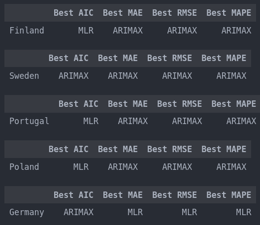

# Final project for my university class of Statistical Models for Data Science

The provided dataset contains estimates of total GDP (gross domestic product) and its components for several countries over the period 1970-2020. This can inform on how these measures have changed over time, and allows to investigate the usefulness of GDP as a measure of wellbeing. These information are available for 220 countries and 17 different indicators were derived.

When run, the notebook will ask a list of 5 countries that the user want to analyze and predict GDP for the years 2010-2020. A complete set of the available nations to input can be found in the file [valid_nations.csv](https://github.com/dariogemo/UNIVR-SMDS/blob/main/valid_nations.csv), which only contains nations from the original dataset that don't have null values and don't lack any of the 17macroeconomic factors. 

If the user doesn't give any input, the notebook will use the following list as the default nations to analyze: Finland, Sweden, Portugal, Algeria, Germany. The GDP components that are used are Import, Export, Manufacturing, Gross Capital.

For every nation, the notebook follows the following pipeline. Firstly some exporatory data analysis is performed on the datasets. Then, 4 models are created that are later used to predict the GDP values from 2010 to 2020, and lastly the results are confronted to retrieve the best model. In the end the user should end up with the best models at predicting the GDP of the selected nations.

The models are the following:
1. ARIMAX: auto_arima function retrieves the best Arima model with exogenous variables that are all the remaining columns of the dataframe.
2. ETS: a grid search is performed to find out the best parameters for the model, i.e error, trend, seasonal, seasonal_period and damped_trend.
3. VARMAX: firstly the columns that granger cause GDP are retrieved. These columns, in addition to the GDP, are used to train the model. The remaining columns are set as exogenous variables. A grid search is performed to find the best "p" and "q" parameters.
4. VARMA: on the contrary from the VARMAX, here all the columns are used as endogenous variables and no exogenous variables are provided. A grid search is performed to find the best "p" and "q" parameters.

The results of the best models for the default countries are the following.

